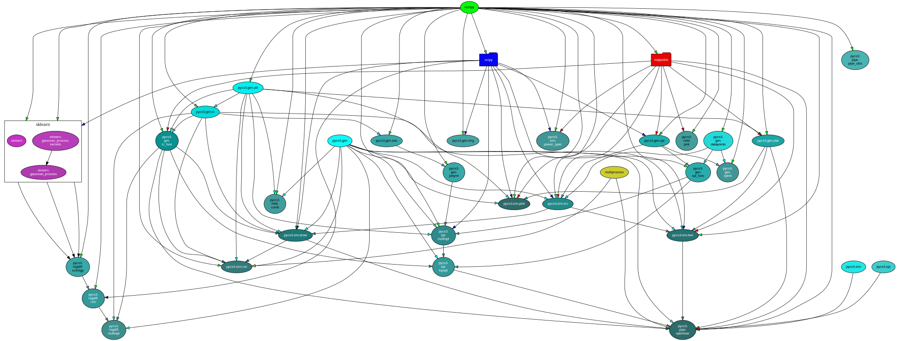

Intra-dependency chart
======================

This chart lists the intra-dependencies of the various modules and files in PyCS.

This plot was generated with ``pydeps`` (`documentation <https://pydeps.readthedocs.io/en/latest/>`_).
Last updated on 2020-06-10. Open the image in a new tab for a better experience.
