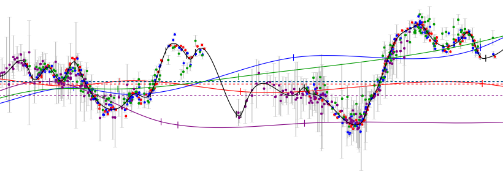

.. PyCS3 documentation master file, created by
   sphinx-quickstart on Fri Aug 10 11:19:31 2018.
   You can adapt this file completely to your liking, but it should at least
   contain the root `toctree` directive.

Welcome to PyCS3's documentation!
=================================

About
-----

PyCS3 is a software toolbox to estimate time delays between multiple images of strongly lensed quasars, from resolved light curves such as obtained by the `COSMOGRAIL <http://www.cosmograil.org/>`_ monitoring program. It comes in the form of a python package, and heavily depends on ``numpy``, ``scipy``, and ``matplotlib`` for its core functionality. The `repository is on GitLab <https://gitlab.com/vbonvin/PyCS3>`_.

To measure time delays with ``pycs3``, you'll typically write a script calling some high-level functions provided by the package. PyCS allows you to compare different point estimators (including your own), without much code integration. You can follow the example `notebooks <https://gitlab.com/vbonvin/PyCS3/-/tree/master/notebook>`_ to learn how to use the core functionnality of PyCS3.

If you have already read our :doc:`papers<citing>`, you might want to proceed with :doc:`installation`, or the :doc:`tutorial/tutorial`. To get a quick first impression of how PyCS3 looks in practice, install PyCS3 and then go directly to the :doc:`tutorial/demo1`. These show you how to **reproduce** the figures from the method paper.

.. warning:: Please read this :doc:`important warning about using PyCS<warning>`.

Questions ?
-----------

Feel free to post an `issue on GitLab <https://gitlab.com/vbonvin/PyCS3/-/issues>`_, or to contact the code authors `Malte Tewes <https://astro.uni-bonn.de/~mtewes>`_ and `Vivien Bonvin <http://people.epfl.ch/vivien.bonvin>`_.

Contents
--------

.. toctree::
   :maxdepth: 2

	A word of warning <warning>
	installation <installation>
	tutorial<tutorial/tutorial>
    Intra-dependency chart <chart>
	citing <citing>
	Autogenerated Full API <source/modules>

.. note:: This documentation is currently rewritten using Sphinx.
	There might still be badly formatted content, especially in the autogenerated API documentation.

Last build of this documentation : |today|.

