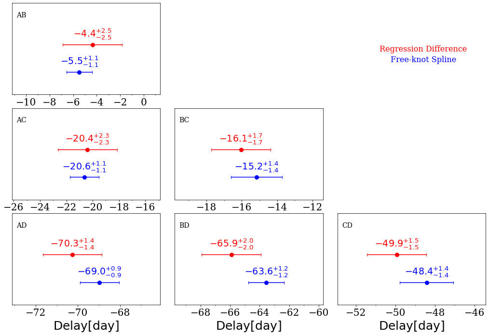

Getting delay histograms and results
====================================

Generalities
------------

To obtain time-delay histograms and point and uncertainty estimates, several steps need to be done; they are presented in the following subsections.
We assume that you have generated some mock curves as described in the previous section.

Run curve shifting algorithms on the mock curves
------------------------------------------------

The wrapper function to run any method on any set of mock curves has the funny name :py:func:`pycs3.sim.run.multirun`.
As input, it takes those pkl files containing simulated curves, made in the previous section. The output of this step are pkl files of runresult objects.

One important argument of ``multirun`` is ``tsrand``. It is the radius (in days) of a uniform randomization of the input time shifts.

Here is an example script running the two methods. We assume that you've defined your favorite optimizers in ``myopt.py``.

::
	
	lcs = pycs3.gen.util.readpickle("merged.pkl")

	
	# Spline method
	"""
	
	# Initial conditions for the analysis :
	# (You might want to set some timeshifts, fluxshifts, as well)
	# In this case we'll just add some spline ML :
	pycs3.gen.splml.addtolc(lcs[0], knotstep=100)
	pycs3.gen.splml.addtolc(lcs[2], knotstep=300)
	pycs3.gen.splml.addtolc(lcs[3], knotstep=300)
	
	#pycs3.sim.run.multirun("copies", lcs, myopt.spl, optset="spl1", tsrand=10.0)
	#pycs3.sim.run.multirun("sim1tsr10", lcs, myopt.spl, optset="spl1", tsrand=10.0)
	"""
	
	# Regdiff method
	"""
	# No need for ml, but time delays should be set about right.
	
	#pycs3.sim.run.multirun("copies", lcs, myopt.regdiff, optset="regdiff2", tsrand=10.0)
	#pycs3.sim.run.multirun("sim1tsr10", lcs, myopt.regdiff, optset="regdiff2", tsrand=10.0)
	"""
	
Parallel computing
------------------
You will probably need more than 500 mock curves to have reliable estimates of the uncertainties. To speed up the computation, you can launch several identical "calls" to this ``multirun`` function (for instance simply by launching your script on several CPUs), and this will indeed process the pkl files in parallel. For this to work, the ``multirun`` function stores a temporary file in its results directory as soon as it starts working on a pickle file, so that other scripts know that they should not run on this same pkl file as well. You can see those temporary files, of course. If something goes wrong and they don't get deleted automatically as the script crashed, you might have to remove the ``.workingon`` files by hand, otherwise ``multirun`` will just skip those pkl files.

Here is an example on how you could perform parallel execution of the ``multirun`` function :

::

    from multiprocess import Pool
    import time

    def exec_worker_mocks_aux(args):
        return exec_worker_mocks(*args)

    def exec_worker_mocks(i, simset_mock, lcs, simoptfct, kwargs_optim, optset, tsrand, destpath):
        print("worker %i starting..." % i)
        time.sleep(i)
        sucess_dic = pycs3.sim.run.multirun(simset_mock, lcs, simoptfct, kwargs_optim=kwargs_optim,
                                           optset=optset, tsrand=tsrand, keepopt=True, destpath=destpath)
        return sucess_dic

    nworkers = 8
    kwargs = {} # if your optimiser, i.e. myopt.spl, takes argument you can pass them here.
    job_args = [(j, "sim1tsr10", lcs, myopt.spl, kwargs, "spl1", 10.0, "./") for j in range(nworkers)]
    p = Pool(nworkers)
    success_list_copies = p.map(exec_worker_copie_aux, job_args)

For a detailed example, you can check this `script <https://gitlab.com/cosmograil/PyCS3/-/blob/master/scripts/3c_optimise_copy_mocks.py>`_.

Analysing the measurement results
---------------------------------

We read the "runresults" pickle files created at the previous step, and turn them into plots.
This is very flexible, as you might want to plot and analyse many things.

To start, we have the function :py:func:`pycs3.sim.run.collect` that collects all the results from one directory::

	results = pycs3.sim.run.collect(directory="./for/example/sims_copies_opt_spl")

The resulting object ``results`` is an instance of the class :py:class:`pycs3.sim.run.RunResults`. If you want to perform your own analysis of the results, you could directly access the following attributes::

	print(results.labels) # A list of the QSO image names (defines the order of QSO images with which the following results are given)
	print(results.tsarray) # A 2D array with the measured time shifts. Shape is (number of sets, number of QSO images)
	print(results.truetsarray) # Idem, for the TRUE time shifts, in case of simulated data
	print(results.qs) # A 1D array with the "chi2" or dispersion values. Shape is (number of sets).

Note that these "tsarrays" contain time shifts, not time delays. To get time delays between images "A" and "B" (i.e., ``results.labels[0]`` and ``results.labels[1]``), you would have to compute the differences yourself::

	measured_delays = results.tsarray[:,1] - results.tsarray[:,0]
	print(measured_delays)

If you want to go straight to some more or less automatic plots showing the results, here is a typical example:

::

		
	copiesres = [
		pycs3.sim.run.collect("sims_copies_opt_spl1", "blue", "Spline"),
		pycs3.sim.run.collect("sims_copies_opt_regdiff1", "green", "Regdiff")
	]
	
	pycs3.sim.plot.hists(copiesres, r=30.0, nbins=100, dataout =True)
	
	
	simres = [
		pycs3.sim.run.collect("sims_sim1tsr10_opt_spl1", "blue", "Splines"),
		pycs3.sim.run.collect("sims_sim1tsr10_opt_regdiff1", "green", "Regdiff")
	]
	
	
	pycs3.sim.plot.hists(simres, r=30.0, nbins=100, dataout =True)
	
	pycs3.sim.plot.measvstrue(simres, r=10.0, nbins = 1, plotpoints=True, ploterrorbars=True, sidebyside=True, errorrange=8, binclip=False, binclipr=20.0, dataout =True)

The measured time delays and their associated uncertainties are stored in pkl files that can be later processed with the :py:mod:`pycs3.tdcomb` :

::

    group_list = [pycs3.tdcomb.comb.getresults(pycs3.tdcomb.comb.CScontainer("Free-knot Spline",
                                                result_file_delays='sims_copies_opt_regdiff1_delays.pkl',
                                                result_file_errorbars='sims_sim1tsr10_opt_regdiff1_errorbars.pkl',
                                                colour = 'blue')),

                  pycs3.tdcomb.comb.getresults(pycs3.tdcomb.comb.CScontainer("Regression Difference",
                                                result_file_delays='sims_copies_opt_spl1_delays.pkl',
                                                result_file_errorbars='sims_sim1tsr10_opt_spl1_errorbars.pkl',
                                                colour = 'red'))
                    ]

    pycs3.tdcomb.plot.delayplot(group_list, rplot=10, hidedetails=True,
                                  showbias=False, showran=False, showlegend=True, figsize=(15, 10), auto_radius=True,
                                  tick_step_auto=True)

	

	
	
	
	

	
