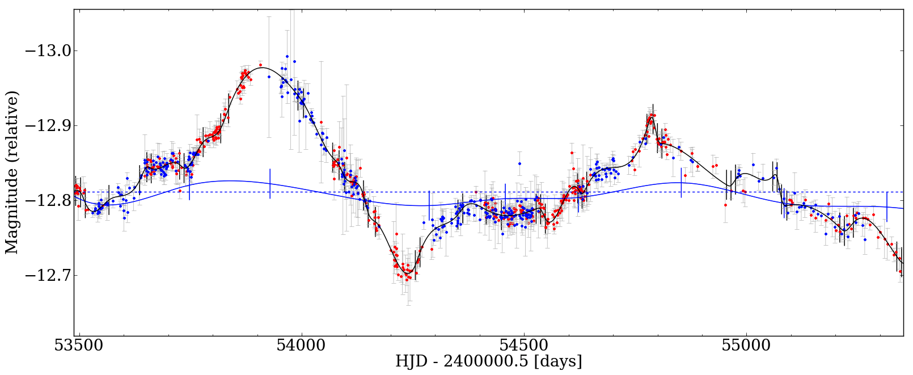

Curve shifting, finally
=======================

PyCS3 makes it very easy to compare different point estimators. You can also add your own, without much code integration or inheritance. You would simply have to provide a python function that shifts instances of the lightcurve class.
High level functions are provided to run these point estimators on both real observations and the synthetic curves. This can be done in parallel on several CPUs, again using a very low tech approach.

This section describes how to do a first optimization of the time shifts (and of course the microlensing) so that the lightcurves of different QSO images "match".

Getting accurate time delay estimations (including the error analysis) is described in the next section.

We assume here that you have some curves (e.g. two, or four), nicely prepared according to the previous steps of this tutorial. Save these nicely merged curves into a pkl, as described earlier.

PyCS3 now support two different optimizers. *Optimizers* are functions that take a list of lightcurves as only argument, and shift these curves (potentially also adjusting the microlensing) so that they match.

.. warning:: The dispersion optimizer is no longer included in PyCS3. This is because the spline and regdiff optimizer outperforms the dispersion optimizer in term of accuracy and are, in addition, much faster. For these reasons, we decided to stop the development of the dispersion technique.

The spline optimizer
--------------------

The idea here is to fit one **single** spline (representing the "intrinsic" variation of the QSO) to all your curves, shifting the latter so that the chi2 between all the datapoints and this single spline is minimal.

This is a very parametric problem, and not a trivial task. The optimizer has to "simultaneously" adjust at least :

* the time/magnitude/flux -shifts of the curves
* the microlensing representation of the curves (polynom coefficients, or spline coeffs and knots)
* the intrinsic spline (both coefficients and knot positions)

In this first approach, we won't describe the internal details. In fact, the spline optimizer works in a very similar way than the dispersion optimizer described above : it shifts your curves, and adjusts their microlensing representations. But of course, it also involves one new object : the spline (that you will want to display on top of your lightcurves) !
Try it :

::

	lcs = pycs3.gen.util.readpickle("merged.pkl")
	
	# We might need some microlensing representations for some of the curves :
	pycs3.gen.splml.addtolc(lcs[1], knotstep=300) # Yep, let's try spline microlensing !
	
	# And now the optimizer. Note that it returns the spline object !
	spline = pycs3.spl.topopt.opt_rough(lcs, nit=5, knotstep=150)
	

To show this spline, we make use of :py:func:`pycs3.gen.lc_func.display` that you've met many times before. Indeed, this function can also display an arbitrary number of splines !

As usual, it's first argument is simply a list of lightcurve objects (or an empty list, if you don't want to show any lightcurves at all). But you can also specify as optional second argument a **list of spline objects** (hence the ``[ ]``) :

::

	pycs3.gen.lc_func.display(lcs, [spline])

Don't expect a perfect fit at this point -- this was just a first demo of the principles of the optimizer.
This particular spline is shown in black, with vertical ticks indicating its knot positions.

The spline optimizer seen above takes a few optional arguments. Some words about the arguments seen at this point :

* ``nit`` is a number of iterations, it's fine to leave it at 5 unless you dig into the details of these optimizers.
* ``knotstep`` sets the initial "spacing" (in days) of the knots. These knots will then move around, so the spacing will change... but the number of knots will not !

.. warning:: A *lower* knotstep corresponds to *more* knots !

When adding the spline microlensing to the curve, we specified ``knotstep=300`` : this is the same parameter, but for the knots of the microlensing. So choose a lower microlensing-``knotstep`` to get a more flexible microlensing.

The above example used the "rough" optimizer. This one is not made to get accurate time delays, but to roughly (and quickly) adjust the shifts and the microlensing so that the curves match somehow. Hence, for this *rough* part, leave a relatively high ``knotstep``.

Directly after this rough optimization, add a call to a finer optimizer :

::

	spline = pycs3.spl.topopt.opt_fine(lcs, nit = 5, knotstep=100)
	

This optimizer will build a new spline from scratch (and return it), using a (usually finer) ``knotstep`` of your choice. Add this line just after the call to opt_rough, and play with the knotstep (e.g. 50) to see the effect. Also note that the knots are now effectively moving (the opt_rough didn't move them).

It's now a good idea to add these optimizers to your ``myopt.py`` file, directly concatenating them ! This allows you to build a custom optimizer for your particular light curve. Here is an example (you should probably update the knotsteps, depending on the curves you want to process) :

::

	def spl(lcs):
		spline = pycs3.spl.topopt.opt_rough(lcs, nit=5, knotstep=40)
		spline = pycs3.spl.topopt.opt_fine(lcs, nit=10, knotstep=30)

		return spline # Do not forget to return the spline !

You can now use ``myopt.spl(lcs)`` to return a spline, that you might want to "catch" by writing

::

	spline = myopt.spl(lcs)
	
As usual, after such an optimization, it might be convenient to save the shifted curves and in this case also the spline into a pickle file, so that you can work on them without rerunning the optimization. Tip : save both the curves and the spline into the same pickle file ! 

::
	
	pycs3.gen.util.writepickle((lcs, spline), "optspl.pkl")
		
	# ...
		
	(lcs, spline) = pycs3.gen.util.readpickle("optspl.pkl")
	pycs3.gen.lc_func.display(lcs, [spline])
		

To learn more about the optional arguments of the spline optimizers, see the doc of :py:func:`pycs3.spl.topopt.opt_rough` and :py:func:`pycs3.spl.topopt.opt_fine`.

These spline optimizers also work with polynomial microlensing. You can mix the microlensing representations at will.

.. note:: Formally, the linear optimization of splines requires data points that are not only sorted, but also *strictly* increasing in jds : it cannot deal with lightcurves that have several data points taken at exactly the same epoch (which may happen as we shift the curves in time). This issue is automatically adressed by the class :py:class:`pycs3.gen.datapoints.DataPoints`. As a user you don't have to worry about this in principle.

The regdiff optimizer
---------------------
This is de facto the easiest method to use, as it does not involve any explicit microlensing representation.

The idea is to shift the light curves so to minimize the variability of their "differences". To compute these difference curves, we need a regression, and in particular we use Gaussian Process Regression as provided by the ``scikit-learn`` module.

.. note:: Therefore, to use the regdiff optimizer, you will have to **install** ``scikit-learn`` first.
	
	Here is the website : `https://scikit-learn.org/stable/ <https://scikit-learn.org/stable/>`_

See `Tewes et al. 2013 <http://dx.doi.org/10.1051/0004-6361/201220123>`_ for a more detailed description of the idea. In practice, as for the spline optimizer, there is a simple top-level wrapper function, that you can add to your ``myopt.py`` :

::

	# we need to call the regdiff module explicitely
	import pycs3.regdiff

	def regdiff(lcs):
		return pycs3.regdiff.multiopt.opt_ts(lcs, pd=5, verbose=True)

But before blindly using the above optimizer, it is a good idea to test by yourself if the the Gaussian Process Regression (GPR) performs well on your lightcurve. The regressions are represented by "regularly sampled light curve" objects, implemented by the class :py:class:`pycs3.regdiff.rslc.Rslc`.
It is easy to perform a regression "manually", i.e. to obtain such a regularly sampled light curve starting from a usual light curve. The function that performs this GPR is :py:func:`pycs3.regdiff.rslc.factory`, and you could for instance directly apply this directly to all your light curves :

::

	myrslcs = [pycs3.regdiff.rslc.factory(l, pd=2) for l in lcs]
	# As this can take a minute, you might want to save the results :
	pycs3.gen.util.writepickle(myrslcs, "myrslcs.pkl")

The parameter ``pd`` is a point density of the regression. Usually this is set to 2 (corresponding to one point every 0.5 days). Less points will give you a faster regression.

You can display these ``Rslc`` objects with the usual display function, simply by putting them in the second argument list, as you would do for spline objects.

::
	
	myrslcs = pycs3.gen.util.readpickle("myrslcs.pkl")
	pycs3.gen.lc_func.display(lcs, myrslcs)

.. note:: These ``Rslc`` have some attributes very similar to the usual ``LightCurve`` objects, like ``jds``, ``mags``, ``magerrs``, ``plotcolour``. To shift an ``Rslc`` in time, use ``myrslc.shifttime(12.3)``. To perform other operations, directly modify the attributes, for instance : ``myrslc.mags += 3.0``.

The reason why we want these finely sampled light curves is that we can easily subtract them from each other to get difference curves. This operation is implemented by :py:func:`pycs3.regdiff.rslc.subtract`.

::
	
	diffrslc = pycs3.regdiff.rslc.subtract(myrslcs[0], myrslcs[1])
	# This diffrslc is the difference curve, and its again a rslc object.
	
	# Hence you can display the difference easily by putting it in the list, for instance :
	pycs3.gen.lc_func.display([], myrslcs + [diffrslc])

Finally, the *WAV* of any ``Rslc`` can be computed by calling the method :py:meth:`pycs3.regdiff.rslc.rslc.wtv`.

