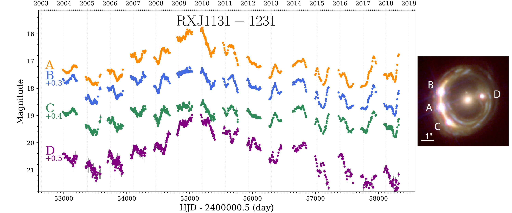

# Summary
Time-delay cosmography is now a competitive technique for measuring the current expansion rate of the Universe, that is, the Hubble Constant [@Wong:2019]. It relies on the strong gravitationnal lensing effect that happens when a massive foreground galaxy deviates the light from a background object, producing multiple mirage images of the same background source. In this configuration, the length of the optical path taken by the photon is slightly different in each multiple image. Thus, the travel time of the photon is also different and the same variations are visible in all multiple images but delayed in time. Lensed quasars or lensed supernovae are ideal targets because they are variable on short time-scale, so the time-delay can be measured and they are sufficiently bright to be observed at cosmological distance. These lens systems can be used to infer the so-called time-delay distance , $D_{\Delta t}$, which is directly inversely proportional to the Hubble Constant. Time-delay cosmography relies on three main ingredients : 

 - a precise and accurate determination of the time delays
 - a model of the mass distribution of the lensing galaxy 
 - an estimate of the mass of all the galaxies along the line of sight that also deviates the light rays, and thus perturb the time delays. 

``PyCS3`` is a python package designed to adress the first of this three points. ``PyCS3`` allows us to measure time delays in lensed quasars in the presence of microlensing, which happens when stars of the lens galaxy are passing in front of the quasar images, also acting as gravitationnal lenses. This introduces some 'extrinsic' variation that are visible in only one image on top of the quasar 'intrinsic' variation visible in all multiple images. ``PyCS3`` provides a flexible modelling of the extrinsic variation with splines to account for microlensing and recover an unbiased estimate of the time delay. An example of the light curves of the multiple images of a lensed quasar is presented in \autoref{fig:lcs}

The previous version of the package was first presented in @Tewes1:2013 and succesfully applied to real data in @Tewes2:2013; @Bonvin:2017; @Bonvin:2018 and @Bonvin:2019. The method was also tested on simulated light curves of the Time-Delay Challenge [@Liao:2016; @Bonvin:2016] and demonstrated that time delays can be measured accurately with a systematic bias $\lesssim$ 1%.   
We also recently presented an automated pipeline based ``PyCS3`` to measure time delays in a large sample of lensed quasars [@Millon1:2020; @Millon2:2020]. Such improvements toward automation of the procedure will be necessary in the coming year with the increasing sample size. 

# Functionnality
The basic functionnality of ``PyCS3`` includes a LightCurve class to manipulate photometric monitoring data. It includes method to import, shift and export light-curves. 

``PyCS3`` also contains two time delay estimators, namely the free knot-spline and the regression difference. These two estimators are fundamentally different and allows us to check the robustness of the measured time delays. The subpackage `pycs3.sim` can be used to generate simulated light curves in order to estimate the uncertainties on the time-delay measurements.
 
The subpackage `pycs3.mltd` contains functions to display and combine the final time-delay estimates. 

here scripts for the automated pipeline

We also present Bastian's stuff

# Acknowledgement

# References