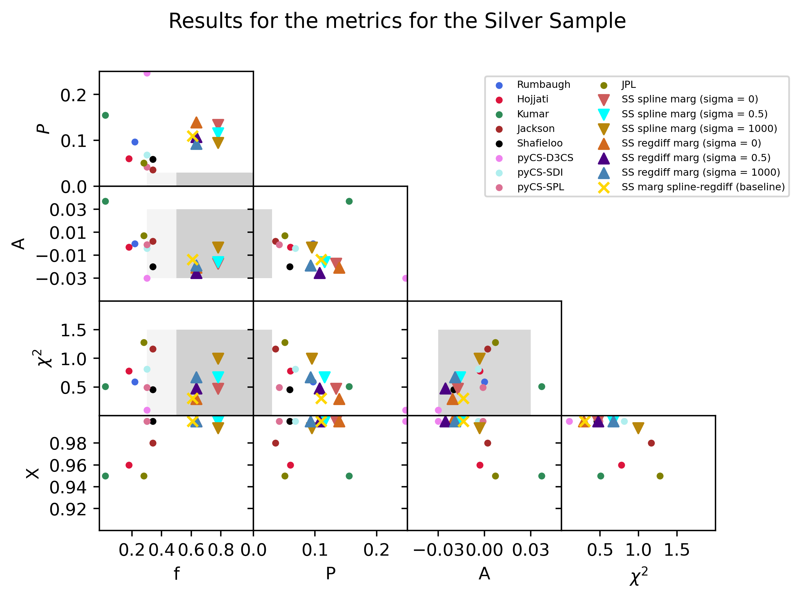

# PyCS3 test pipeline

This folder contains all the script to process multiple light curves from the TDC at the same time. It aims at providing a test framework to check the precision and accuracy of PyCS3. It is based on the original pipeline which is in the `script` folder. A list of light curves from the TDC1 ([Liao et al. (2015)](https://arxiv.org/abs/1409.1254)) that can be used with this sub-package are available [here](https://lsstdesc.org/TimeDelayChallenge/downloads.html).

Four metrics were selected in the Time-Delay challenge to evaluate the performance of the curve-shifting techniques : 
* the accuracy 
* the precision 
* the $`\chi^2`$ 
* X, the fraction of outliers (with a $`\chi^2`$ > 10). 

We recently ran this test pipeline on the first 200 curves of the rung 3 of the TDC1. Those data closely mimics the real Euler light curves in terms of cadence, photometric noise and microlensing. We reproduce here Figure 8 of [Liao et al. (2015)](https://arxiv.org/abs/1409.1254), which summarizes the 4 metrics in one plot : 

*TDC1 rung 3 results. The dots are blind submissions from [Liao et al. (2015)](https://arxiv.org/abs/1409.1254). Our new results with PyCS3 and both the spline and regression difference estimators are marked with triangles. The different strategies to marginalise between estimator parameters are parametrized with the `sigma` threshold parameter (see. [Millon et al. (2020)](https://arxiv.org/abs/2002.05736) for details.)*

The results presented here are for our *Silver Sample* (SS), which contains more than 60% of the curves. We excluded the curves with a precision >40% and ones with a time delay > 100 days, which does not have enough overlap to measure a robust time delay. Of course, the results were not *blinded* here, but this demonstrates that `PyCS3` was able to measure the time-delay in most of curves of the TDC1 rung3 with an automated procedure with an accuracy better than 2%. 

## Using the pipeline 

You should first define a working directory that must contain your light curves in the sub-folder `data`. 
Your data should have the naming convention `name_double_pairX_ECAM.rdb` with X the number of the light curve and must contain one column for the days of the observation and two columns per lens image for the measured magnitudes and its associated uncertainties. 
You also need to have the true time delay for your light curves in the sub-folder `data/truth` with the naming convention `truth_name.txt` where the second column are the true time delay like in the following example :
        test_double_pair1     -70.89
        test_double_pair2     104.22
        test_double_pair3     56.59

## 0. Set up
 
Run the command : 

    python3 multiple_0.py name double numberofcurves --dir='path_to_working_directory'

This will set up the directories for this multiple pipeline and generate the multiple config file in the `./config/multiple` directory under the name `config_multiple_name.py` and can be modified before running the next script. Check the [README](../scripts/README.md) from the main pipeline for more information on the different parameters.

## 1. Create data set 

Run the command : 

    python3 multiple_1.py name double numberofcurves --dir='path_to_working_directory'

This will run the script `1_create_dataset.py` from the PyCS3 main pipeline for all the curves. The specific config file for each of the curve is created in `config` directory under the name `config_name_double_pairX_EXAM.py`. The single config files are then updated with the parameters from the multiple config file previously mentioned.
The initial guess will be randomly taken around the true time delay from the `./data/truth/truth_name.txt`.
The initial guesses are saved in `./Simulation/multiple/name_double/post_gaussian_guess.txt`. 

## 2. Fit spline 

Run the command : 

    python3 multiple_2.py name double numberofcurves --dir='path_to_working_directory'

This will run the script `2_fit_spline.py` from the PyCS3 main pipeline for each curve.

## 3. Launch spline 

Modify the `./cluster/multiple_launcher.sh` with the parameters from your cluster. Then make sure the line 18 execute the `start_3all.slurm` and update the number of curves you will run on the line 28. Then run the command while in the `./cluster` folder :

    ./multiple_launcher.sh

This will run the script `3a_generate_tweakml.py`, `3b_draw_copy_mocks.py`, `3c_optimise_copy_mocks.py` and `3d_check_statistics.py` from the PyCS3 main pipeline for each curves.

## 4a. Get the time delay for the spline 

Run the command : 

    python3 multiple_4a.py name double numberofcurves --dir='path_to_working_directory'

This will run the script `4a_plot_results.py` from the PyCS3 main pipeline for each curve.

##  3bis. Launch regdiff 

Run the command : 

    python3 multiple_update_config.py name double numberofcurves --dir='path_to_working_directory'

Update every config file in order to use the regdiff instead of the spline.
Then modify the `./cluster/multiple_launcher.sh` with the parameters from your cluster. Then make sure the line 18 execute the `start_3c.slurm` and update the number of curves you will run on the line 28. Then run the command while in the `./cluster` folder :

    ./multiple_launcher.sh

This will run the script `3c_optimise_copy_mocks.py` from the PyCS3 main pipeline for each curves, but this time with regdiff.

## 4a. Get the time delay for the regdiff

Run the command : 

    python3 multiple_4a.py name double numberofcurves --dir='path_to_working_directory'

This will run the script `4a_plot_results.py` from the PyCS3 main pipeline for each curve, but this time with regdiff.

## 4b. Margininalise the spline Estimates 

Run the command : 

    python3 multiple_4b.py name double numberofcurves --dir='path_to_working_directory'

This will run the script `4b_marginalise_spline.py` from the PyCS3 main pipeline for each curve for three different `sigmathresh = 0, 0.5, 1000`. You can find information on the marginalisation in the README of the main pipeline.

## 4b. Margininalise the regdiff Estimates 

Run the command : 

    python3 multiple_4c.py name double numberofcurves --dir='path_to_working_directory'

This will run the script `4c_marginalise_regdiff.py` from the PyCS3 main pipeline for each curve for three different `sigmathresh = 0, 0.5, 1000`. You can find information on the marginalisation in the README of the main pipeline.

## 4d. Marginalise spline and regression difference Estimates 

Run the command : 

    python3 multiple_4d.py name double numberofcurves --dir='path_to_working_directory'

This will run the script `4d_marginalise_rall.py` from the PyCS3 main pipeline for each curve with both the `sigmathresh = 0.5`. 

## 6. Compute TDC1 metrics
You need to update the `config_multiple_name.py` with the simulation that failed in the `failed_sim` list. You can then choose if you want to display the gold and silver sample and add the pair you want in the silver/golden sample.
You can also decide what plot you want to have displayed. Then, run the command :

    python3 multiple_6.py name double numberofcurves --dir='path_to_working_directory'

This will compute the statistics for each sample, and for each estimate. Summary files are created in the `./Simulation/multiple/name` folder. A sub-folder `figure` is also created and contains all the figure produced.
